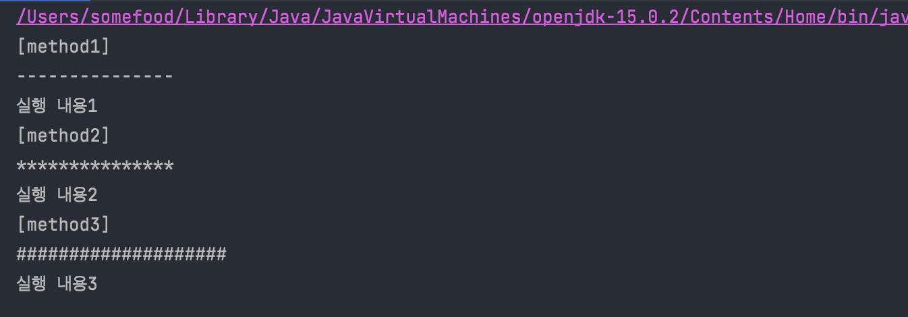

# JAVA Annotation

by 홍석주

---

## 스프링을 봐보면서..

```java
@Controller
public MemberController() {}

@Autowired
private MemberRepository memberRepository;
```

어노테이션을 달면 스프링에서 무언가 일어나진다.. 어노테이션은 대체 뭘까..

---

## 어노테이션(Annotation)

- 코드 사이에 주석처럼 쓰이며 특별한 의미, 기능을 수행하도록 하는 기술
- 메타 데이터 역할 (데이터를 위한 데이터)

```java
@Override

@Deprecated

@FunctionalInterface
```

---

## 어노테이션의 용도

- 컴파일러에게 코드 작성 문법 에러를 체크하도록 정보를 제공해준다.
- 빌드나 배치시 코드를 자동으로 생성할 수 있도록 정보 제공
- 실행(런타임)시 특정 기능을 실행하도록 정보 제공

## 사용 순서

1. 어노테이션 정의
2. 클래스에 어노테이션 배치
3. **Reflection을** 이용하여 추가 정보를 획득하여 기능 실시

---

## Reflection(리플렉션)

- 런타임 시에 클래스의 메타 정보를 얻는 기능
- 클래스가 가진 필드, 생성자, 메소드, 적용된 어노테이션이 무엇인지 알아낼 수 있다.

### 메소드 `java.lang.reflect의 Field, Constructor, Method`

- getFields(): 필드 정보를 Field[] 배열로 리턴
- getConstructors(): 생성자 정보를 Constructor[] 배열로 리턴
- getDeclaredMethods(): 메소드 정보를 Method[] 배열로 리턴

---

## 사용 방법

### 어노테이션 선언

```java
@Target(범위)
@Retention(유효)
public @interface 이름 {
    타입 이름() [default 값];
    String st() default "Hello";
    int it() default 5;
}
```

### 적용

```java
@이름(st="World")
적용대상

@이름(st="World", it=3)
적용대상
// 밑에건 안됨. 순서 지키거나 키워드로 해결
@이름(3)
```

---

## @Target

어떠한 값에 어노테이션을 적용할 것인지 지정하는 어노테이션

|ElementType 상수|적용 대상|
|----------------|--------|
|TYPE|클래스, 인터페이스|
|ANNOTATION_TYPE|어노테이션|
|FILED|필드|
|CONSTRUCTOR|생성자|
|METHOD|메소드|
|LOCAL_VARIABLE|지역 변수|
|PACKAGE|패키지|

---

## @Retention

어노테이션 값들을 언제까지 유지할 것인지 설정. 주로 Runtime을 많이 사용한다 한다.

|Retention 상수|적용 대상|
|----------------|--------|
|SOURCE|소스 상에서만 어노테이션 정보를 유지. <br /> 소스코드를 분석할 때만 의미가 있고, 바이트 코드 파일에는 정보가 남지 않음|
|CLASS|바이트 코드 파일까지 어노테이션 정보를 유지. 리플렉션을 이용해서 어노테이션 정보를 얻을 수는 없음.|
|RUNTIME|바이트 코드 파일까지 어노테이션 정보를 유지하면서, 리플렉션을 이용해서 런타임 시에 어노테이션 정보를 얻을 수 있음|

---

## 간단 사용법

라인 구분을 문자열로 해주는 어노테이션 실습해보기

```java
import java.lang.annotation.ElementType;
import java.lang.annotation.Retention;
import java.lang.annotation.RetentionPolicy;
import java.lang.annotation.Target;

@Target({ElementType.METHOD})
@Retention(RetentionPolicy.RUNTIME)
public @interface PrintAnnotation {
    String value() default "-";
    int number() default 15;
}
```

---

```java
public class Service {

    @PrintAnnotation
    public void method1() {
        System.out.println("실행 내용1");
    }

    @PrintAnnotation("*")
    public void method2() {
        System.out.println("실행 내용2");
    }

    @PrintAnnotation(value = "#", number = 20)
    public void method3() {
        System.out.println("실행 내용3");
    }
}
```

---

```java
package anno3;

import java.lang.reflect.Method;
import java.util.Arrays;

public class PrintAnnotationExample {
    public static void main(String[] args) {
        Method[] declaredMethods = Service.class.getDeclaredMethods();

        for (Method method: declaredMethods) {
            if(method.isAnnotationPresent(PrintAnnotation.class)) {
                PrintAnnotation printAnnotation = method.getDeclaredAnnotation(PrintAnnotation.class);
                System.out.println("[" + method.getName() +"]");

                for(int i=0; i < printAnnotation.number(); i++) {
                    System.out.print(printAnnotation.value());
                }
                System.out.println();

                try {
                    method.invoke(new Service());
                } catch (Exception e) {
                    System.out.println();
                }
            }
        }
    }
}
```

---


