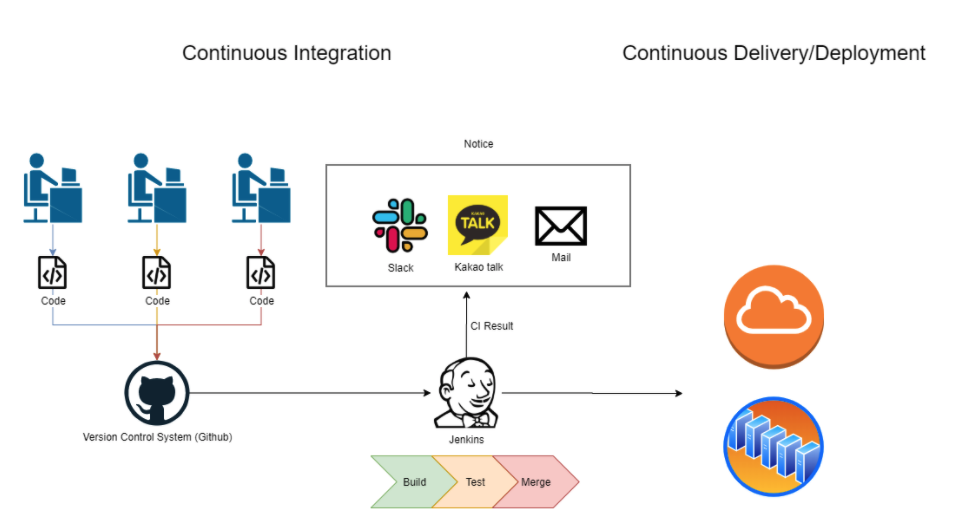
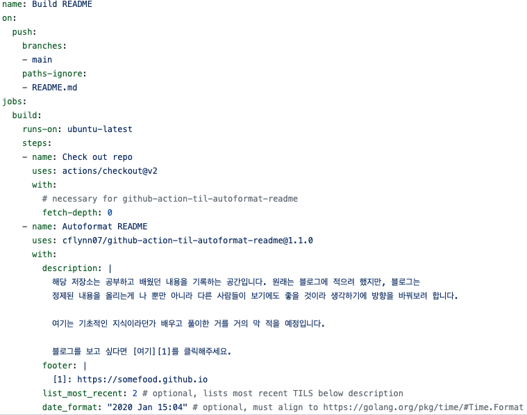
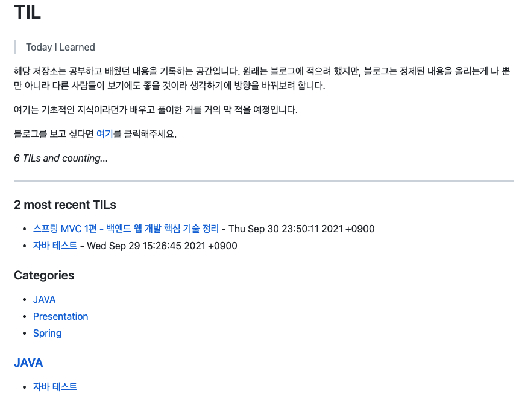

# CI/CD 그리고 Github Action

by 홍석주

---

## 서비스를 제공하기 위해

- 컴파일: 컴퓨터가 이해할 수 있는 내용으로 변환
- 빌드: 컴파일 된 코드를 실제 실행할 수 있는 상태로 변환
- 배포: 빌드가 완성된 실행 가능한 파일을 사용자가 접근할 수 있는 환경에 배치

### -> 코드를 수정하면 위의 행위를 반복해야하는 불편함을 초래

---

## CI (Continuous Integration)

- 지속적인 통합을 의미
- 테스트와 빌드를 자동으로 진행하는 프로세스
- 즉, code 작성 - Build - TEST를 짧은 주기로 자동화 할 수 있다.

```text
1. 개발자들은 퇴근 전 자신의 코드를 중앙 코드와 통합한다.
2. 메일로 발송된 결과 리포트를 확인하고 버그가 있으면 수정
```

---

## CD (Continuous Deploy, Continuous Delivery)

- 지속적인 배포를 의미
- 애플리케이션에 적용한 변경 사항이 버그 테스트를 거쳐 리포지토리에 업로드 되는 것을 의미
- 배포 자동화

---

## 작동 방식



---

## Github Action



---

## Result


