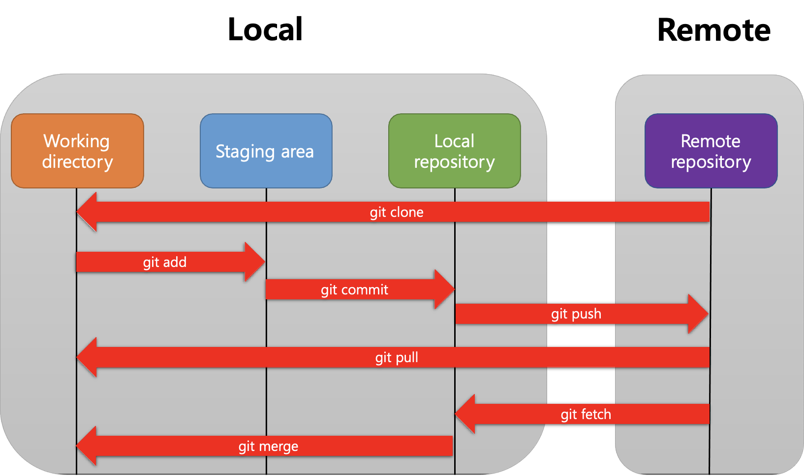
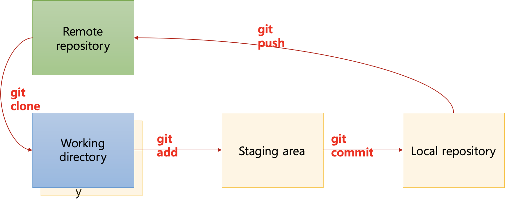
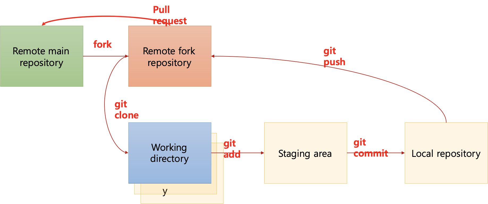

# Git과 Github

by 홍석주

---


# Git과 Github이란?

## Git

- SW 개발 과정에서 생기는 변경사항을 추적하는 분산 버전 관리 시스템
- 자신이 작업한 코드를 텍스트 명령어 입력 방식으로 저장할 수 있다.

## Github

- git 데이터를 온라인에 저장해주는 사이트
- 간편한 그래픽 유저 인터페이스(GUI)를 제공한다.
- 자신이 작업한 코드를 간편하게 확인할 수 있고, 이를 공유하여 협업할 수 있다.

---

## Git을 사용하는 이유?

git은 이전 기록과 달라진 부분들을 기록한다.

v1.0을 개발했고, v1.1을 개발하는 중인데 프로그램이 정상적으로 실행되지 않는다.

이럴 경우 v1.0과 v1.1에서 달라진 부분들을 쉽게 확인할 수 있기 때문에 에러를 찾기 쉽습니다.

또한 에러를 찾지 못했다고 해도 v1.0으로 되돌아 갈 수 있다.

---

# Git workflow



---

# Git workflow


---

# Git 사용방법

## clone

원격 git 저장소 복제

`git clone [복사한 HTTPS URL]`

## add

파일을 staging area로 이동(저장할 파일을 선택하는 과정)
commit을 하기 위한 필수 준비 과정

`git add [파일]`

---      

## commit

staging area에 있는 파일들을 저장
commit 기록이 남고,  이를 확인, 복원을 할 수 있다.

`git commit -m "[커밋 메시지]"`

## git config 설정

commit으로 기록을 남기려고 하는데, 내가 누군인지 정보를 등록해줘야 기록할 수 있다.

```bash
git config --global user.email "[email]"
git config --global user.name "[username]"
```  

---

## push

local 저장소에 있는 변경사항들을 remote 저장소로 옮김

이 과정을 github에서 확인이 가능

`git push [remote 이름] [branch 이름]`
 
## pull

Remote 저장소에 있는 내용을 local(working directory)로 가져옴

`git pull [remote 이름] [branch 이름]`
        
---

# 정리




1. GitHub에서 Remote 저장소생성
2. git clone: Remote 저장소를 working directory로 가져옴
3. git add: Working directory에서 일어난 변경사항을 staging area로 옮김 (1차저장)
4. git commit: Staging area에 있는 변경사항을 local 저장소로 옮김 (2차저장)
5. git push: local 저장소에 있는 변경사항들을 remote 저장소로 옮김
6. git pull: Remote 저장소에 있는 내용을 working directory로 가져옴

---

## fetch & merge

pull = fetch + merge

fetch: `git fetch [remote 이름] [branch 이름]`

변경 사항을 가져오지만, working directory에 반영되진 않음

merge: `git merge [remote 이름] [branch 이름]`

fetch로 가져온 변경 사항을 working directory에 씀

---

## branch

현재 commit에 대한 코드를 통째로 복사해서 다른 branch의 코드와 상관없이 독립적인 개발공간을 제공해주는 도구

main branch는 주 branch이며, 오류없이 작동하는 최종 코드를 저장되는 공간.

실험적인 코드는 독립적인 새로운 branch에서 작업을 진행하고 문제가 있으면 branch를 떼어버리면 되고 문제가 없으면 그 branch를 main에 merge하면 된다.

1. branch 생성: `git branch [브랜치 이름]`
2. branch 이동: `git checkout [브랜치 이름]`
3. branch 생성과 이동: `git checkout -b [브랜치 이름]`
4. branch 삭제: `git branch -d [브랜치 이름]`
5. branch 조회: `git branch`
     
---

## 기타 명령어

1. `git remote -v`: 원격 저장소에 대한 link 확인
2. `git status`: 현재 git 상태를 보여줌
3. `git diff`: 현재 어떤 내용이 바뀌었는지 보여줌
4. `git log`: commit 현황을 보여줌
5. `git reset`: 이전 commit을 취소할 수 있음 (여러 옵션 존재)
    
    e.g. `git reset HEAD^`: 최근 commit 취소 
    
---

# Github으로 협업하기




### 협업의 큰 틀

1. 프로젝트 repo를 fork하여 개인 github에 복사한다.
2. 각자 로컬 환경에서 개발한 내용을 origin에 push한다.
3. 해당 내용을 upstream에 pull request한다.
4. 코드 리뷰 후 최종 수정된 코드를 upstream에 merge한다.
5. 변경된 upstream의 내용을 pull로 로컬에 반영한다.