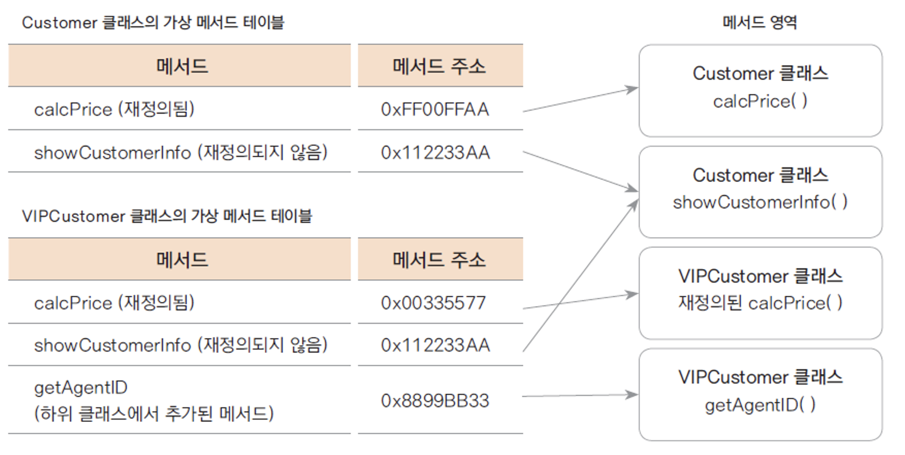
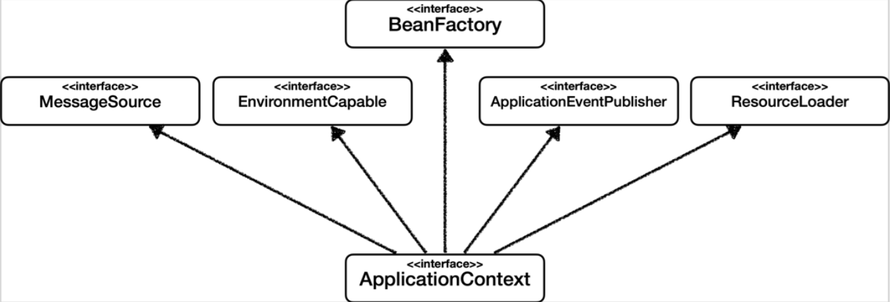
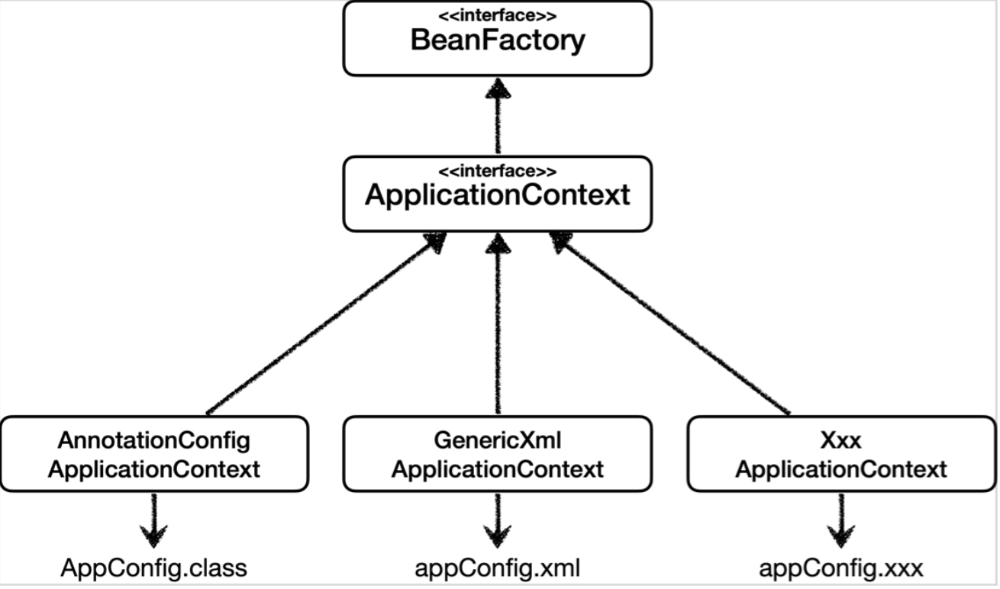

# 다형성과 빈에 대해 알아보자

---

## 다형성이란 (polymorphism)

- 다형성(polymorphism)이란 하나의 객체가 여러 가지 타입을 가질 수 있는 것을 의미.

- 자바에서는 이러한 다형성을 부모 클래스 타입의 참조 변수로 자식 클래스 타입의 인스턴스를 참조할 수 있도록 하여 구현하고 있다.

- 다형성은 상속, 추상화와 더불어 객체 지향 프로그래밍을 구성하는 중요한 특징 중 하나

---

## 예시 코드

### 인터페이스 선언

```java
public interface MemberRepository {
    void save(Member member);
    void findById(Long id);
} 
```

### 구현체 작성 (구현 내용은 생략)

```java
public class MemoryMemberRepository implements MemberRepository {
}

public class JPAMemberRepository implements MemberRepository {
}
```

---

## 선언

```java
public class MemberServiceImpl implements MemberService {

    private final MemberRepository memberRepository = new MemoryMemberRepository();
}
```

## JPA로 바꾸고 싶다면?

```java
private final MemberRepositry memberRepository = new JPAMemberRepository();
```

## 사용

```java
memberRepository.save(member);
```

> 구현체에 따라 작동 방식은 다르겠지만, 결론적으로 멤버 저장이 일어난다. 이것이 다형성의 핵심!

---

## 어떻게 작동하는 걸까

### Virtual Method Invocation



> 참고: 패스트캠퍼스 자바 강의

---

## 문제점

다형성 좋다. 근데 코드상에서 내가 다른 구현체로 갈아끼우려고 한다면?
한군데만 바꾸면 되지만, 여러 위치에 있으면?

추가로 SOLID의 DIP와 OCP에 위배된다.

```java
public class MemberServiceImpl implements MemberService {

    // private final MemberRepository memberRepository = new MemoryMemberRepository();
    private final MemberRepository memberRepository = new JPAMemberRepository();
}
```

---

## 해결법

- 인터페이스에만 의존하게 만든다.
- 근데 이러면 또 NPE(NullPointerException)이 터진다. 구현체를 참조하지 않으니깐.

```java
public class MemberServiceImpl implements MemberService {
    private MemberRepository memberRepository;
}
```

> 그럼 또 어떻게 해야할까..

---

구현 객체를 만들고, 이를 연결해주는 클래스를 만들자.

```java
// AppConfig.class
public class AppConfig {

    public MemberService memberService() {
        return new MemberServiceImpl(memberRepository());
    }

    public MemberRepository memberRepository() {
        return new MemoryMemberRespository();
    }
}

```

```java
public class MemberServiceImpl implements MemberService {
    private MemberRepository memberRepository;

    public MemberServiceImpl(MemberRepository memberRepository) {
        this.memberRepository = memberRepository;
    }
}
```

---

## 스프링 DI 컨테이너와 빈

- 우리는 구현 객체를 주입을 해주는 AppConfig 클래스를 생성했다.
- 스프링에서도 이처럼 객체를 주입해주는 컨테이너가 있는데 이른 DI 컨테이너라 부른다.
- 향후 @Service, @Controller라는 어노테이션만을 달아주는 것만으로도 스프링이 특정 요청에 맞추어 메서드들을 실행시켜주는데 이를 IoC, 제어의 역전이라고 한다.
- 그렇기 위해 빈 객체를 등록해주어야 한다.

---

## @Configuration 어노테이션과 @Bean 어노테이션

```java
@Configuration
public class AppConfig {

    @Bean
    public MemberService memberService() {
        return new MemberServiceImpl(memberRepository());
    }

    @Bean
    public MemberRepository memberRepository() {
        return new MemoryMemberRepository();
    }

    @Bean
    public OrderService orderService() {
        return new OrderServiceImpl(memberRepository(), discountPolicy());
    }

    @Bean
    public DiscountPolicy discountPolicy() {
        return new RateDiscountPolicy();
    }
}

```

---

## 빈 등록 시

- 빈 이름은 기본적으로 메서드명과 동일하게 지어진다.
- 수동 설정 시, @Bean(name="이름")
- 빈 이름은 다른 이름으로 구분지어주자. 같은 이름으로 할 경우 하나가 무시되어 의도치 않은 오류가 발생할 수 있다.
- 빈 객체를 갖고올 때는 getBean() 메서드를 활용한다.

---


## BeanFactory, ApplicationContext



- 메시지 소스를 활용한 국제화 기능
  - 한국에서 들어오면 한국어로, 영어권에서 들어오면 영어로 출력
- 환경변수
  - 로컬, 개발, 운영등을 구분해서 처리
- 애플리케이션 이벤트
  - 이벤트를 발행하고 구독하는 모델을 편리하게 지원
- 편리한 리소스 조회
  - 파일, 클래스패스, 외부 등에서 리소스를 편리하게 조회

---

## ApplicationContext를 통해 빈 객체 갖고오기

```java
ApplicationContext ac = AnnotationApplicationContext(AppConfig.class);
MemberService memberService = ac.getBean("memberService", MemberService.class);
```

ApplicationContext는 인터페이스이고, AnnotationApplicationContext가 구현체이다.

---

## 다양한 설정 형식 지원



위와 같이 Java, XML 등으로 빈들을 만들 수 있는데,
최종적으로 BeanDefinition라는 메타 정보를 만들어 주면 되기 때문이다.