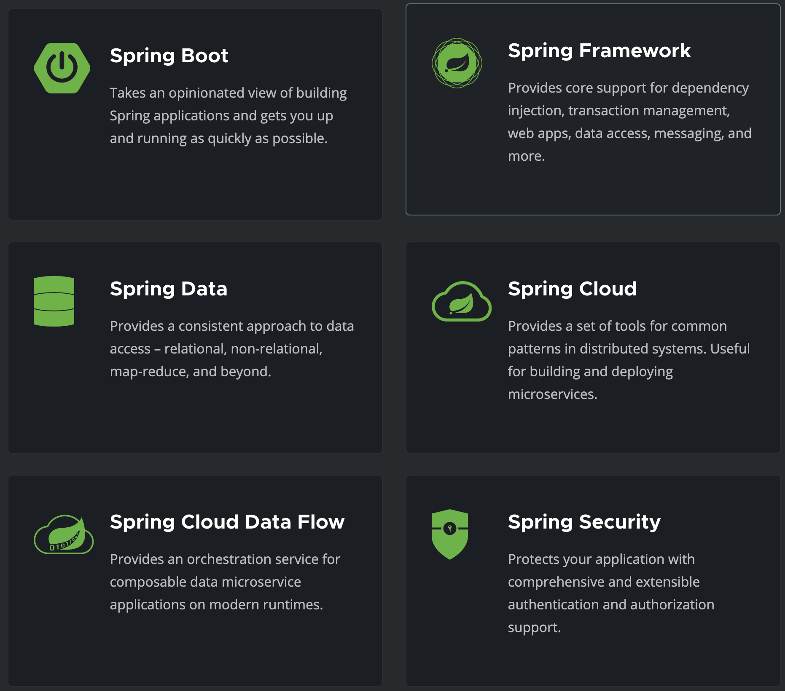
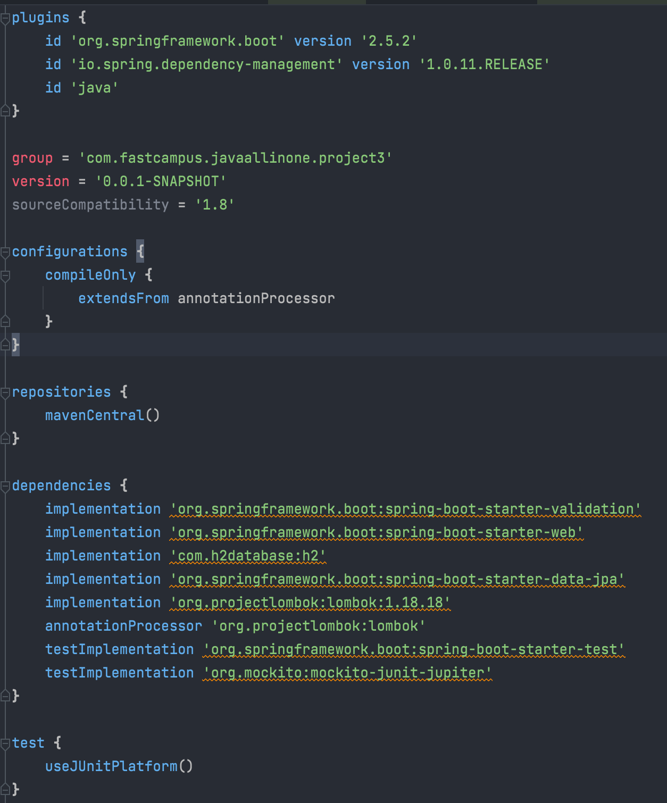

# 스프링 기초 용어 정리

by 홍석주

---

## 처음이니 초간단 자기소개..

- 2015~2020 네트워크 엔지니어 ~~(머릿속에 남은게 1도 없음 ㅎㅎ)~~
- 현재는 백엔드 엔지니어 희망
- 파이썬, 자바 정도 다룰줄 앎.

잘 부탁드립니다.

---

## 장고를 처음 봤을 때 느낌


1. pip install django
2. settings에서 app 등록하고, url 등록하고
3. views에서 로직 달아주고
4. python manage.py runserver하면 실행~!

> 기초만 다뤄서 그런거겠지만 나름 괜찮다??
---

## 스프링을 처음 봤을 떄 느낌



- 스프링5와 스프링부트가 있다는데 이 차이는 뭘까? (일단 스프링 OOO이 너무 많다.)
- 빌드는 무엇일까? (gradle, maven?)
- IoC? DI? 처음부터 어러운 용어 투성이었다.

> 용어 정리부터 하고 가자

---

## 빌드(Build)

- 소스코드 파일들을 컴퓨터에 실행할 수 있는 소프트웨어로 변환하는 일련의 과정으로, 컴파일, 테스팅, 배포 등 모든 과정의 집합.
- 빌드 도구는 이러한 빌드 과정을 자동으로 수행해주는 도구이다.
- 대표적으로 Maven, Gradle 등이 있다.
- Maven과 Gradle을 사용하면 우리가 필요한 라이브러리를 편하게 설치할 수 있고, 라이브러리가 의존하는 패키지들을 알아서 설치해준다.

---



---

## 스프링이란

- JAVA 기반으로 자바 엔터프라이즈 개발을 편하게 해주는 오픈소스 경량급 애플리케이션 프레임워크 (현재 스프링5을 많이 씀)
- 과거에 사용하던 EJB라는 프레임워크를 대체하기 위해 등장했다.
- 스프링하면 대표적 특징으론 IOC, DI 등이 있다.

---

## IoC(Inversion of Control)

- 제어 역전이란 뜻
- 원래라면 객체 생성이나 의존관계 연결 등은 개발자가 직접 해야했던 부분을 스프링 컨테이너가 관리하여 필요할 때 생성하고 연결지고 해준다.
- 즉, 우리는 비즈니스 로직에만 집중하면 된다.

> 컨테이너란 우리가 작성한 코드의 처리과정을 위임받은 독립적인 존재이다.
---

## DI (Dependency Injection)

- 의존성 주입이라는 뜻
- 기존의 의존이란 한 클래스에서 다른 클래스의 인스턴스를 만들고 메서드 등을 사용하면 의존한다고 본다.
- 아래와 같이 하면 관리 측면에서 불편해진다. (새로운 객체가 생성되기에 관리하기 어려움)

```java
// 의존 객체를 직접 생성
public class MyController {
    private MemberDao memberDao = new MemberDao();

    public String welcome() {
        return memberDao.insert("seokju");
    }
}
```

---

```java
import java.util.Collection;
import java.util.HashMap;
import java.util.Map;

public class MemberDao {
    
    private static long nextId = 0;
    
    private Map<String, Member> map = new HashMap<>();
    
    public Member selectByEmail(String email) {
        return map.get(email);
    }
    
    public void insert(Member member) {
        member.setId(++nextId);
        map.put(member.getEmail(), member);
    }
    
    public void update(Member member) {
        map.put(member.getEmail(), member);
    }
    
    public Collection<Member> selectAll() {
        return map.values();
    }
}
```

---

## 의존성을 주입해보자.

빈 객체로 등록을 해준다.

```java
@Configuration
public class AppCtx {   
    @Bean
    public MemberDao memberDao() {
        return new MemberDao();
    }
}
```

스프링에서 제공하는 @Autowired 사용 (빈 객체는 싱글톤으로 관리된다.)

```java
public class MyController {
    @Autowired
    private MemberDao memberDao;

    public String welcome() {
        return memberDao.insert("seokju");
    }
}
```

---

## AOP(Aspect Oriented Programming)

- 관점 지향 프로그래밍
- 어떤 로직을 기준으로 핵심적인 관점, 부가적인 관점으로 나누고 그 관점을 기준으로 각각 모듈화
- 핵심적인 관점(Core Concerns): 업무 로직을 포함하는 기능
- 부가적인 관점(Cross-cutting Concerns): 핵심 기능을 도와줌(DB연결, 로깅 등)


---

## 스프링 부트는

- 기존 스프링은 의존 라이브러리들을 설정해주어야 할게 많아 나 같은 입문자에겐 큰 벽이었다.
- 이런 문제를 자동화적으로 해결해주는 것이 스프링 부트이다.
- starter 디펜던시만 추가해주면 필요한 패키지들을 설치해주고 우리는 run만 하면 된다.

```
<dependency>
    <groupId>org.springframework.boot</groupId>
    <artifactId>spring-boot-starter-web</artifactId>
</dependency>
```

```java
import org.springframework.boot.SpringApplication;
import org.springframework.boot.autoconfigure.SpringBootApplication;

@SpringBootApplication
public class MycontactApplication {
    public static void main(String[] args) {
        SpringApplication.run(MycontactApplication.class, args);
    }
}
```